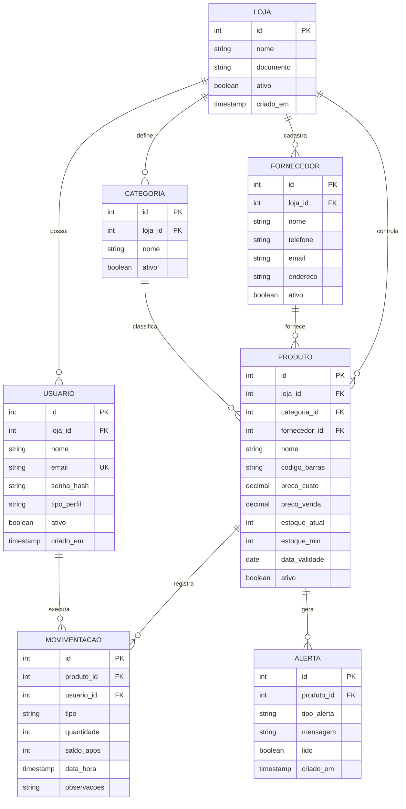

# Modelagem de Dados — StockEasy

**Projeto:** StockEasy — Controle de Estoque Inteligente
**Artefato do Checkpoint 1 (11/09/2026), revisado para a entrega N1 (29/09 a 02/10/2026)**
**SGBD:** PostgreSQL (remoto) + SQLite (local)
**Versão:** 2.0 — 28/09/2026

---

## Histórico de revisão

A versão 1.0 foi entregue no Checkpoint 1 com cinco entidades. A revisão para a N1 incorporou as seguintes correções, todas decorrentes de inconsistências identificadas na revisão interna dos artefatos:

| Correção                                                                     | Motivo                                                                                                                             |
| ---------------------------------------------------------------------------- | ---------------------------------------------------------------------------------------------------------------------------------- |
| Inclusão da entidade `loja`                                                  | A história US04 previa operadores vinculados a uma loja, mas o modelo não tinha esse escopo                                        |
| Inclusão da entidade `categoria`                                             | O cadastro de produto previa criar categoria nova, incompatível com a restrição de lista fixa anterior                             |
| `movimentacao.usuario_id` passou a `NOT NULL` com remoção em modo restritivo | A tabela de atributos declarava `NOT NULL`, mas o script usava `ON DELETE SET NULL` — declarações incompatíveis                    |
| Chave estrangeira do histórico passou a restritiva                           | A remoção em cascata apagaria o histórico junto com o produto, invalidando a auditoria de RN05                                     |
| Remoção de índices redundantes sobre colunas já únicas                       | Restrições `UNIQUE` criam índice implícito no PostgreSQL                                                                           |
| Remoção da definição de idioma na criação do banco                           | `LC_COLLATE 'pt_BR.UTF-8'` falha em ambientes sem esse idioma instalado                                                            |
| Correção da junção na consulta de produtos de baixo giro                     | A condição estava invertida (`p.produto_id = m.id`), o que produziria resultado incorreto                                          |
| Gatilho de alerta passou a cobrir inclusão, não apenas alteração             | Produto cadastrado já em situação crítica não gerava alerta                                                                        |
| Carga de exemplo reescrita                                                   | Os produtos eram inseridos já com o saldo final e as movimentações eram simuladas depois, produzindo histórico incoerente          |
| Inclusão de colunas de sincronização e identificador universal               | Necessárias para a idempotência descrita na decisão DA07 do memorial de arquitetura                                                |
| Colunas de data e hora passaram de `TIMESTAMP` para `TIMESTAMPTZ`            | Sem fuso horário, chamadas com `NOW()` não casavam com a assinatura da função e a sincronização entre dispositivos ficaria ambígua |
| Gatilho passou a não gerar alerta no cadastro de produto com saldo zero      | Saldo zero no cadastro significa produto não abastecido, não crítico; sem a condição, todo cadastro criava um alerta espúrio       |

Os dois últimos itens foram identificados ao executar o script em um servidor PostgreSQL real, não por leitura do código. Os testes estão registrados na seção Validação executada, ao final deste documento.

---

## Diagrama Entidade-Relacionamento (DER)

### Diagrama



### Representação Textual (versão 1.0, mantida para referência)

```
┌─────────────────┐
│     USUARIO     │
├─────────────────┤
│ PK id           │
│    nome         │
│    email        │◁───────────────┐
│    senha_hash   │                │
│    tipo_perfil  │                │ 1
│    ativo        │                │
│    criado_em    │                │
└─────────────────┘                │
                                   │
                                   │
┌─────────────────┐                │
│   FORNECEDOR    │                │
├─────────────────┤                │
│ PK id           │◁───────┐       │
│    nome         │        │ 1     │
│    telefone     │        │       │
│    email        │        │       │
│    endereco     │        │       │
│    observacoes  │        │       │
│    criado_em    │        │       │
└─────────────────┘        │       │
                           │       │
                           │       │
┌─────────────────┐        │       │
│    PRODUTO      │        │       │
├─────────────────┤        │       │
│ PK id           │        │       │
│    nome         │        │       │
│    codigo_barras│        │       │
│    categoria    │        │       │
│ FK fornecedor_id├────────┘ N     │
│    preco_custo  │                │
│    preco_venda  │                │
│    estoque_atual│                │
│    estoque_min  │                │
│    data_validade│                │
│    foto_url     │                │
│    ativo        │                │
│    criado_em    │                │
│    atualizado_em│                │
└─────────────────┘                │
         △                         │
         │ N                       │
         │                         │
         │                         │
┌─────────────────┐                │
│  MOVIMENTACAO   │                │
├─────────────────┤                │
│ PK id           │                │
│ FK produto_id   ├────────────────┘
│ FK usuario_id   ├────────────────┐
│    tipo         │                │ N
│    quantidade   │                │
│    saldo_apos   │                │
│    data_hora    │                │
│    observacoes  │                │
└─────────────────┘                │
                                   │
                                   │
┌─────────────────┐                │
│     ALERTA      │                │
├─────────────────┤                │
│ PK id           │                │
│ FK produto_id   ├────────────────┘
│    tipo_alerta  │
│    mensagem     │
│    lido         │
│    criado_em    │
└─────────────────┘
```

---

## Entidades e Atributos Detalhados

### 1. USUARIO

**Descrição:** Armazena informações dos usuários do sistema (proprietários e operadores).

| Atributo    | Tipo         | Restrições              | Descrição                    |
| ----------- | ------------ | ----------------------- | ---------------------------- |
| **id**      | SERIAL       | PRIMARY KEY             | Identificador único          |
| nome        | VARCHAR(100) | NOT NULL                | Nome completo do usuário     |
| email       | VARCHAR(100) | NOT NULL, UNIQUE        | E-mail de login (único)      |
| senha_hash  | VARCHAR(255) | NOT NULL                | Hash da senha (bcrypt)       |
| tipo_perfil | VARCHAR(20)  | NOT NULL, CHECK         | 'PROPRIETARIO' ou 'OPERADOR' |
| ativo       | BOOLEAN      | NOT NULL, DEFAULT TRUE  | Se o usuário está ativo      |
| criado_em   | TIMESTAMPTZ  | NOT NULL, DEFAULT NOW() | Data/hora de criação         |

**Regras:**

- E-mail deve ser único no sistema (índice único)
- Senha armazenada como hash bcrypt (nunca texto plano)
- `tipo_perfil` usa ENUM ou CHECK constraint: ('PROPRIETARIO', 'OPERADOR')

---

### 2. FORNECEDOR

**Descrição:** Cadastro de fornecedores de produtos.

| Atributo    | Tipo         | Restrições              | Descrição              |
| ----------- | ------------ | ----------------------- | ---------------------- |
| **id**      | SERIAL       | PRIMARY KEY             | Identificador único    |
| nome        | VARCHAR(100) | NOT NULL                | Nome do fornecedor     |
| telefone    | VARCHAR(20)  |                         | Telefone de contato    |
| email       | VARCHAR(100) |                         | E-mail de contato      |
| endereco    | TEXT         |                         | Endereço completo      |
| observacoes | TEXT         |                         | Observações adicionais |
| criado_em   | TIMESTAMPTZ  | NOT NULL, DEFAULT NOW() | Data/hora de criação   |

**Regras:**

- Nome obrigatório
- Telefone e e-mail opcionais
- Não pode ser excluído se houver produtos vinculados (restrição de FK)

---

### 3. PRODUTO

**Descrição:** Cadastro de produtos comercializados.

| Atributo          | Tipo          | Restrições                      | Descrição                            |
| ----------------- | ------------- | ------------------------------- | ------------------------------------ |
| **id**            | SERIAL        | PRIMARY KEY                     | Identificador único                  |
| nome              | VARCHAR(150)  | NOT NULL                        | Nome do produto                      |
| codigo_barras     | VARCHAR(50)   | UNIQUE                          | Código de barras (EAN-13, UPC, etc.) |
| categoria         | VARCHAR(50)   | NOT NULL                        | Categoria do produto                 |
| **fornecedor_id** | INTEGER       | FOREIGN KEY → FORNECEDOR(id)    | Fornecedor do produto                |
| preco_custo       | DECIMAL(10,2) | NOT NULL, CHECK >= 0            | Preço de custo unitário              |
| preco_venda       | DECIMAL(10,2) | NOT NULL, CHECK >= 0            | Preço de venda unitário              |
| estoque_atual     | INTEGER       | NOT NULL, DEFAULT 0, CHECK >= 0 | Quantidade em estoque                |
| estoque_min       | INTEGER       | NOT NULL, DEFAULT 0, CHECK >= 0 | Estoque mínimo (alerta)              |
| data_validade     | DATE          |                                 | Data de validade (opcional)          |
| foto_url          | VARCHAR(255)  |                                 | URL da foto do produto               |
| ativo             | BOOLEAN       | NOT NULL, DEFAULT TRUE          | Se o produto está ativo              |
| criado_em         | TIMESTAMPTZ   | NOT NULL, DEFAULT NOW()         | Data/hora de criação                 |
| atualizado_em     | TIMESTAMPTZ   | NOT NULL, DEFAULT NOW()         | Data/hora da última atualização      |

**Regras:**

> **Atualizado na versão 2.0:** o campo `categoria` deixou de ser texto com lista fixa e passou a ser `categoria_id`, chave estrangeira para a tabela `categoria`. A lista fixa impedia o usuário de criar categorias próprias, previsto no cadastro de produto e na tela de configurações. O produto também passou a ter `loja_id`.

- Nome obrigatório
- `codigo_barras` único **dentro da loja** (RN04), não globalmente: lojas distintas vendem o mesmo produto e usam o mesmo código EAN
- `categoria_id` obrigatório, referenciando uma categoria da própria loja
- Preços devem ser >= 0
- `estoque_atual` não pode ser negativo
- `fornecedor_id` pode ser NULL (produto sem fornecedor definido)
- FK `fornecedor_id` restritiva: implementa RN13, impedindo a exclusão de fornecedor com produtos vinculados

**Índices:**

- `codigo_barras` (único)
- `categoria` (para filtros)
- `fornecedor_id` (para joins)
- `estoque_atual` (para consultas de produtos críticos)

---

### 4. MOVIMENTACAO

**Descrição:** Histórico de todas as entradas e saídas de produtos.

| Atributo       | Tipo        | Restrições                          | Descrição                            |
| -------------- | ----------- | ----------------------------------- | ------------------------------------ |
| **id**         | SERIAL      | PRIMARY KEY                         | Identificador único                  |
| **produto_id** | INTEGER     | NOT NULL, FOREIGN KEY → PRODUTO(id) | Produto movimentado                  |
| **usuario_id** | INTEGER     | NOT NULL, FOREIGN KEY → USUARIO(id) | Usuário que registrou                |
| tipo           | VARCHAR(30) | NOT NULL, CHECK                     | Tipo de movimentação                 |
| quantidade     | INTEGER     | NOT NULL, CHECK > 0                 | Quantidade movimentada               |
| saldo_apos     | INTEGER     | NOT NULL, CHECK >= 0                | Saldo do estoque após a movimentação |
| data_hora      | TIMESTAMPTZ | NOT NULL, DEFAULT NOW()             | Data/hora da movimentação            |
| observacoes    | TEXT        |                                     | Observações opcionais                |

**Regras:**

- `tipo` usa ENUM ou CHECK constraint: ('COMPRA', 'DEVOLUCAO_CLIENTE', 'AJUSTE_ENTRADA', 'VENDA', 'PERDA', 'VENCIMENTO', 'DEVOLUCAO_FORNECEDOR', 'AJUSTE_SAIDA', 'OUTROS')
- `quantidade` sempre positivo (> 0)
- `saldo_apos` não pode ser negativo (>= 0)
- FK `produto_id` **restritiva**: impede a exclusão física de produto com histórico, preservando a auditoria de RN05
- FK `usuario_id` **`NOT NULL` e restritiva**: RN05 exige saber quem registrou cada lançamento. A versão 1.0 declarava `NOT NULL` na tabela mas usava `ON DELETE SET NULL` no script — declarações incompatíveis entre si. Usuários são desativados, nunca excluídos
- O registro é **imutável**: não há alteração nem exclusão de movimentação. Correções são feitas por lançamento de ajuste em sentido contrário (decisão DA04)

**Índices:**

- `produto_id` (para histórico por produto)
- `usuario_id` (para auditoria por usuário)
- `tipo` (para filtros)
- `data_hora` (para ordenação cronológica)

**Observação importante:** A coluna `saldo_apos` é **desnormalizada intencionalmente** para facilitar consultas de auditoria. Sempre que uma movimentação é registrada, o `estoque_atual` do produto é atualizado e o novo saldo é gravado aqui.

---

### 5. ALERTA

**Descrição:** Alertas gerados automaticamente (estoque crítico, vencimento próximo).

| Atributo       | Tipo        | Restrições                          | Descrição                        |
| -------------- | ----------- | ----------------------------------- | -------------------------------- |
| **id**         | SERIAL      | PRIMARY KEY                         | Identificador único              |
| **produto_id** | INTEGER     | NOT NULL, FOREIGN KEY → PRODUTO(id) | Produto relacionado ao alerta    |
| tipo_alerta    | VARCHAR(30) | NOT NULL, CHECK                     | Tipo do alerta                   |
| mensagem       | TEXT        | NOT NULL                            | Mensagem do alerta               |
| lido           | BOOLEAN     | NOT NULL, DEFAULT FALSE             | Se o alerta foi lido/visualizado |
| criado_em      | TIMESTAMPTZ | NOT NULL, DEFAULT NOW()             | Data/hora de criação             |

**Regras:**

- `tipo_alerta` usa ENUM: ('ESTOQUE_CRITICO', 'VENCIMENTO_PROXIMO')
- FK `produto_id` com ON DELETE CASCADE (se produto excluído, alerta também é excluído)
- Alertas são gerados automaticamente por triggers ou lógica de aplicação
- Alertas não lidos são exibidos no dashboard

**Índices:**

- `produto_id` (para buscar alertas por produto)
- `lido` (para filtrar alertas não lidos)
- `tipo_alerta` (para agrupar por tipo)

---

## Relacionamentos

A política de remoção segue uma decisão única, registrada como RN12: **nenhuma entidade de cadastro é removida fisicamente**. Produtos, fornecedores, categorias e usuários são desativados pelo campo `ativo`. Por isso as chaves estrangeiras são restritivas, e não em cascata — a restrição é o que garante, no nível do banco, que uma remoção acidental não destrua o histórico.

| Relacionamento         | Cardinalidade | Chave estrangeira                         | Remoção  | Justificativa                                                           |
| ---------------------- | ------------- | ----------------------------------------- | -------- | ----------------------------------------------------------------------- |
| LOJA ↔ USUARIO         | 1:N           | `usuario.loja_id` → `loja.id`             | RESTRICT | A loja é o escopo dos dados; removê-la deixaria registros órfãos        |
| LOJA ↔ CATEGORIA       | 1:N           | `categoria.loja_id` → `loja.id`           | RESTRICT | Idem                                                                    |
| LOJA ↔ FORNECEDOR      | 1:N           | `fornecedor.loja_id` → `loja.id`          | RESTRICT | Idem                                                                    |
| LOJA ↔ PRODUTO         | 1:N           | `produto.loja_id` → `loja.id`             | RESTRICT | Idem                                                                    |
| CATEGORIA ↔ PRODUTO    | 1:N           | `produto.categoria_id` → `categoria.id`   | RESTRICT | Categoria é obrigatória; excluí-la deixaria o produto sem classificação |
| FORNECEDOR ↔ PRODUTO   | 1:N           | `produto.fornecedor_id` → `fornecedor.id` | RESTRICT | Implementa RN13 diretamente no banco                                    |
| USUARIO ↔ MOVIMENTACAO | 1:N           | `movimentacao.usuario_id` → `usuario.id`  | RESTRICT | RN05 exige saber quem registrou; o campo é `NOT NULL`                   |
| PRODUTO ↔ MOVIMENTACAO | 1:N           | `movimentacao.produto_id` → `produto.id`  | RESTRICT | Preserva o histórico; a cascata invalidaria a auditoria de RN05         |
| PRODUTO ↔ ALERTA       | 1:N           | `alerta.produto_id` → `produto.id`        | CASCADE  | Única exceção: alerta é estado derivado, não histórico                  |

O alerta é a única relação em cascata, por um motivo específico: ele não é registro de auditoria, e sim estado derivado do saldo. Pode ser recalculado a qualquer momento a partir de `produto.estoque_atual` e `produto.estoque_min`. Perdê-lo não perde informação.

A versão 1.0 deixava a política de `PRODUTO ↔ MOVIMENTACAO` como decisão aberta, anotada como "definir com a equipe". A decisão está tomada e justificada acima.

---

## Normalização

O modelo está na **Terceira Forma Normal (3FN)**:

### 1FN — Primeira Forma Normal

- ✅ Todos os atributos são atômicos (valores simples, não multivalorados)
- ✅ Cada coluna contém valores do mesmo tipo
- ✅ Cada linha é única (chaves primárias definidas)

### 2FN — Segunda Forma Normal

- ✅ Está na 1FN
- ✅ Todos os atributos não-chave dependem da chave primária completa (não há dependências parciais)
- Exemplo: Em MOVIMENTACAO, `quantidade`, `tipo`, `data_hora` dependem de `id` (chave primária)

### 3FN — Terceira Forma Normal

- ✅ Está na 2FN
- ✅ Não há dependências transitivas (atributos não-chave não dependem de outros atributos não-chave)
- Exemplo: Fornecedor está em tabela separada, não duplicado em cada produto

### Exceção: Desnormalização Intencional

- **Coluna `saldo_apos` em MOVIMENTACAO:** Guarda o saldo do estoque após cada movimentação para facilitar auditoria e evitar recalcular o histórico completo. Esse trade-off é aceitável em sistemas transacionais com requisitos de auditoria.

---

## Scripts SQL de Criação (PostgreSQL)

> A versão executável destes scripts está em [`../banco/`](../banco/), já verificada em PostgreSQL 16. Os blocos abaixo são a mesma coisa, no contexto da explicação. **Ao alterar um, alterar o outro.**

```sql
-- =============================================
-- CRIAÇÃO DO BANCO DE DADOS
--
-- Sem LC_COLLATE explícito: fixar 'pt_BR.UTF-8' faz o script falhar em
-- ambientes que não têm esse idioma instalado (contêineres Alpine, macOS).
-- A ordenação sensível a acento é resolvida por collation na consulta.
-- =============================================

CREATE DATABASE stockeasy_db ENCODING 'UTF8';

\c stockeasy_db;

-- =============================================
-- TABELA: LOJA
-- Escopo de todos os dados. Um usuário, um produto e um fornecedor
-- sempre pertencem a uma loja (exigência da história US04).
-- =============================================

CREATE TABLE loja (
    id SERIAL PRIMARY KEY,
    uuid UUID NOT NULL UNIQUE DEFAULT gen_random_uuid(),
    nome VARCHAR(120) NOT NULL,
    documento VARCHAR(20),
    ativo BOOLEAN NOT NULL DEFAULT TRUE,
    criado_em TIMESTAMPTZ NOT NULL DEFAULT NOW(),
    atualizado_em TIMESTAMPTZ NOT NULL DEFAULT NOW()
);

-- =============================================
-- TABELA: USUARIO
-- =============================================

CREATE TABLE usuario (
    id SERIAL PRIMARY KEY,
    uuid UUID NOT NULL UNIQUE DEFAULT gen_random_uuid(),
    loja_id INTEGER NOT NULL REFERENCES loja(id) ON DELETE RESTRICT,
    nome VARCHAR(100) NOT NULL,
    email VARCHAR(100) NOT NULL UNIQUE,
    senha_hash VARCHAR(255) NOT NULL,
    tipo_perfil VARCHAR(20) NOT NULL CHECK (tipo_perfil IN ('PROPRIETARIO', 'OPERADOR')),
    ativo BOOLEAN NOT NULL DEFAULT TRUE,
    criado_em TIMESTAMPTZ NOT NULL DEFAULT NOW(),
    atualizado_em TIMESTAMPTZ NOT NULL DEFAULT NOW()
);

-- Não se cria índice sobre email: a restrição UNIQUE já gera um índice
-- implícito, e um segundo seria redundante e custoso na escrita.
CREATE INDEX idx_usuario_loja ON usuario(loja_id);

-- =============================================
-- TABELA: CATEGORIA
-- Substitui a lista fixa que havia em produto.categoria. O usuário pode
-- criar categorias próprias, o que a restrição CHECK anterior impedia.
-- =============================================

CREATE TABLE categoria (
    id SERIAL PRIMARY KEY,
    uuid UUID NOT NULL UNIQUE DEFAULT gen_random_uuid(),
    loja_id INTEGER NOT NULL REFERENCES loja(id) ON DELETE RESTRICT,
    nome VARCHAR(60) NOT NULL,
    ativo BOOLEAN NOT NULL DEFAULT TRUE,
    criado_em TIMESTAMPTZ NOT NULL DEFAULT NOW(),
    -- O nome é único dentro da loja, não globalmente
    CONSTRAINT uq_categoria_loja_nome UNIQUE (loja_id, nome)
);

-- =============================================
-- TABELA: FORNECEDOR
-- =============================================

CREATE TABLE fornecedor (
    id SERIAL PRIMARY KEY,
    uuid UUID NOT NULL UNIQUE DEFAULT gen_random_uuid(),
    loja_id INTEGER NOT NULL REFERENCES loja(id) ON DELETE RESTRICT,
    nome VARCHAR(100) NOT NULL,
    telefone VARCHAR(20),
    email VARCHAR(100),
    endereco TEXT,
    observacoes TEXT,
    ativo BOOLEAN NOT NULL DEFAULT TRUE,
    criado_em TIMESTAMPTZ NOT NULL DEFAULT NOW(),
    atualizado_em TIMESTAMPTZ NOT NULL DEFAULT NOW()
);

CREATE INDEX idx_fornecedor_loja_nome ON fornecedor(loja_id, nome);

-- =============================================
-- TABELA: PRODUTO
-- =============================================

CREATE TABLE produto (
    id SERIAL PRIMARY KEY,
    uuid UUID NOT NULL UNIQUE DEFAULT gen_random_uuid(),
    loja_id INTEGER NOT NULL REFERENCES loja(id) ON DELETE RESTRICT,
    nome VARCHAR(150) NOT NULL,
    codigo_barras VARCHAR(50),
    categoria_id INTEGER NOT NULL REFERENCES categoria(id) ON DELETE RESTRICT,
    fornecedor_id INTEGER REFERENCES fornecedor(id) ON DELETE RESTRICT,
    preco_custo DECIMAL(10,2) NOT NULL CHECK (preco_custo >= 0),
    preco_venda DECIMAL(10,2) NOT NULL CHECK (preco_venda >= 0),
    estoque_atual INTEGER NOT NULL DEFAULT 0 CHECK (estoque_atual >= 0),
    estoque_min INTEGER NOT NULL DEFAULT 0 CHECK (estoque_min >= 0),
    data_validade DATE,
    foto_url VARCHAR(255),
    ativo BOOLEAN NOT NULL DEFAULT TRUE,
    criado_em TIMESTAMPTZ NOT NULL DEFAULT NOW(),
    atualizado_em TIMESTAMPTZ NOT NULL DEFAULT NOW(),
    -- RN04: o código de barras é único dentro da loja, não globalmente.
    -- Lojas distintas vendem o mesmo produto e usam o mesmo código EAN.
    CONSTRAINT uq_produto_loja_codigo UNIQUE (loja_id, codigo_barras)
);

-- Índices de apoio às consultas frequentes. Não se indexa codigo_barras
-- isoladamente: a restrição UNIQUE composta acima já atende à busca.
CREATE INDEX idx_produto_loja ON produto(loja_id);
CREATE INDEX idx_produto_categoria ON produto(categoria_id);
CREATE INDEX idx_produto_fornecedor ON produto(fornecedor_id);

-- Índice parcial para a consulta de produtos críticos: cobre apenas as
-- linhas ativas, que são as únicas consultadas nesse cenário.
CREATE INDEX idx_produto_critico ON produto(loja_id, estoque_atual)
    WHERE ativo = TRUE;

-- Trigger para atualizar atualizado_em automaticamente
CREATE OR REPLACE FUNCTION atualizar_timestamp()
RETURNS TRIGGER AS $$
BEGIN
    NEW.atualizado_em = NOW();
    RETURN NEW;
END;
$$ LANGUAGE plpgsql;

CREATE TRIGGER trigger_produto_atualizado
BEFORE UPDATE ON produto
FOR EACH ROW
EXECUTE FUNCTION atualizar_timestamp();

-- =============================================
-- TABELA: MOVIMENTACAO
-- =============================================

CREATE TABLE movimentacao (
    id SERIAL PRIMARY KEY,
    -- Identificador gerado no dispositivo, base da idempotência (DA07):
    -- permite reconhecer reenvio após falha de rede sem duplicar o registro.
    uuid UUID NOT NULL UNIQUE,
    -- RESTRICT, não CASCADE: apagar um produto levaria embora todo o
    -- histórico e invalidaria a auditoria exigida por RN05. Produtos são
    -- desativados (ativo = FALSE), nunca removidos — regra RN12.
    produto_id INTEGER NOT NULL REFERENCES produto(id) ON DELETE RESTRICT,
    -- NOT NULL com RESTRICT: RN05 exige saber quem registrou cada
    -- movimentação. Usuários são desativados, não excluídos.
    usuario_id INTEGER NOT NULL REFERENCES usuario(id) ON DELETE RESTRICT,
    tipo VARCHAR(30) NOT NULL CHECK (tipo IN (
        'COMPRA', 'DEVOLUCAO_CLIENTE', 'AJUSTE_ENTRADA',
        'VENDA', 'PERDA', 'VENCIMENTO', 'DEVOLUCAO_FORNECEDOR', 'AJUSTE_SAIDA', 'OUTROS'
    )),
    quantidade INTEGER NOT NULL CHECK (quantidade > 0),
    saldo_apos INTEGER NOT NULL CHECK (saldo_apos >= 0),
    data_hora TIMESTAMPTZ NOT NULL DEFAULT NOW(),
    observacoes TEXT
);

-- Índice composto: cobre o histórico por produto em ordem cronológica,
-- que é a consulta da tela de detalhes do produto.
CREATE INDEX idx_movimentacao_produto_data ON movimentacao(produto_id, data_hora DESC);
CREATE INDEX idx_movimentacao_usuario ON movimentacao(usuario_id);
CREATE INDEX idx_movimentacao_tipo_data ON movimentacao(tipo, data_hora DESC);

-- =============================================
-- TABELA: ALERTA
-- =============================================

CREATE TABLE alerta (
    id SERIAL PRIMARY KEY,
    -- CASCADE é intencional aqui, e é a única exceção no modelo: o alerta
    -- não é registro de auditoria, e sim estado derivado do saldo. Pode ser
    -- recalculado a partir de estoque_atual e estoque_min, então perdê-lo
    -- não perde informação. Todas as demais chaves são RESTRICT (RN12).
    produto_id INTEGER NOT NULL REFERENCES produto(id) ON DELETE CASCADE,
    tipo_alerta VARCHAR(30) NOT NULL CHECK (tipo_alerta IN ('ESTOQUE_CRITICO', 'VENCIMENTO_PROXIMO')),
    mensagem TEXT NOT NULL,
    lido BOOLEAN NOT NULL DEFAULT FALSE,
    criado_em TIMESTAMPTZ NOT NULL DEFAULT NOW()
);

-- Índices para filtros de alertas
CREATE INDEX idx_alerta_produto ON alerta(produto_id);
CREATE INDEX idx_alerta_lido ON alerta(lido);
CREATE INDEX idx_alerta_tipo ON alerta(tipo_alerta);

-- =============================================
-- TRIGGER: Gerar Alerta de Estoque Crítico
-- =============================================

CREATE OR REPLACE FUNCTION verificar_estoque_critico()
RETURNS TRIGGER AS $$
BEGIN
    -- Produto inativo não mantém alerta pendente (RN12)
    IF NEW.ativo = FALSE THEN
        UPDATE alerta
        SET lido = TRUE
        WHERE produto_id = NEW.id
          AND tipo_alerta = 'ESTOQUE_CRITICO'
          AND lido = FALSE;
        RETURN NEW;
    END IF;

    -- Produto recém-cadastrado e ainda sem nenhuma entrada não gera
    -- alerta: saldo zero no cadastro significa "não abastecido", não
    -- "crítico". Sem esta condição, todo cadastro de produto criaria um
    -- alerta espúrio, já que 0 é sempre menor ou igual ao mínimo.
    IF TG_OP = 'INSERT' AND NEW.estoque_atual = 0 THEN
        RETURN NEW;
    END IF;

    -- Se estoque ficar <= estoque_min, gerar alerta
    IF NEW.estoque_atual <= NEW.estoque_min THEN
        -- Só cria se ainda não houver alerta pendente do mesmo tipo,
        -- para não acumular avisos repetidos do mesmo produto (RN07)
        IF NOT EXISTS (
            SELECT 1 FROM alerta
            WHERE produto_id = NEW.id
              AND tipo_alerta = 'ESTOQUE_CRITICO'
              AND lido = FALSE
        ) THEN
            INSERT INTO alerta (produto_id, tipo_alerta, mensagem, lido)
            VALUES (
                NEW.id,
                'ESTOQUE_CRITICO',
                'Produto "' || NEW.nome || '" está com estoque crítico (' || NEW.estoque_atual || ' unidades)',
                FALSE
            );
        END IF;
    ELSE
        -- Se estoque voltar ao normal, marcar alertas como lidos
        UPDATE alerta
        SET lido = TRUE
        WHERE produto_id = NEW.id
          AND tipo_alerta = 'ESTOQUE_CRITICO'
          AND lido = FALSE;
    END IF;

    RETURN NEW;
END;
$$ LANGUAGE plpgsql;

-- Dispara na INCLUSÃO e na ALTERAÇÃO. A versão 1.0 cobria apenas
-- AFTER UPDATE OF estoque_atual, então produto cadastrado já em situação
-- crítica não gerava alerta nenhum.
CREATE TRIGGER trigger_estoque_critico
AFTER INSERT OR UPDATE OF estoque_atual, estoque_min, ativo ON produto
FOR EACH ROW
EXECUTE FUNCTION verificar_estoque_critico();

-- =============================================
-- DADOS DE EXEMPLO (SEED)
--
-- Corrigido na versão 2.0. A carga anterior inseria o produto já com o
-- saldo final e depois registrava movimentações "simulando" chegar
-- naquele valor, produzindo histórico incoerente. Agora o produto entra
-- com saldo zero e o saldo é construído pelas movimentações, que é como
-- a aplicação realmente opera.
-- =============================================

-- Loja
INSERT INTO loja (nome, documento) VALUES
('Mercearia Modelo', '12.345.678/0001-90');

-- Usuários: um de cada perfil, para demonstrar RN01.
-- Senha de ambos: "admin123" (resumo BCrypt com fator de custo 10)
INSERT INTO usuario (loja_id, nome, email, senha_hash, tipo_perfil) VALUES
(1, 'Marlene Proprietária', 'proprietario@stockeasy.com',
 '$2a$10$N9qo8uLOickgx2ZMRZoMyeIjZAgcfl7p92ldGxad68LJZdL17lhWy', 'PROPRIETARIO'),
(1, 'Júnior Operador', 'operador@stockeasy.com',
 '$2a$10$N9qo8uLOickgx2ZMRZoMyeIjZAgcfl7p92ldGxad68LJZdL17lhWy', 'OPERADOR');

-- Categorias
INSERT INTO categoria (loja_id, nome) VALUES
(1, 'Alimentos'), (1, 'Bebidas'), (1, 'Limpeza'), (1, 'Higiene'), (1, 'Outros');

-- Fornecedores
INSERT INTO fornecedor (loja_id, nome, telefone, email) VALUES
(1, 'Distribuidora ABC Ltda', '(62) 3333-4444', 'contato@abc.com.br'),
(1, 'Comercial XYZ', '(62) 3555-6666', 'vendas@xyz.com.br'),
(1, 'Atacadão Central', '(62) 3777-8888', 'compras@atacadaocentral.com.br');

-- Produtos entram com estoque zero: o saldo é construído pelo histórico
INSERT INTO produto
    (loja_id, nome, codigo_barras, categoria_id, fornecedor_id,
     preco_custo, preco_venda, estoque_atual, estoque_min, data_validade) VALUES
(1, 'Arroz Tipo 1 5kg',          '7891234567890', 1, 1, 15.00, 22.00, 0, 10, NULL),
(1, 'Feijão Preto 1kg',          '7891234567891', 1, 1,  6.50, 10.00, 0, 15, NULL),
(1, 'Refrigerante Cola 2L',      '7891234567892', 2, 2,  4.00,  7.50, 0, 20, '2026-11-30'),
(1, 'Detergente Líquido 500ml',  '7891234567893', 3, 2,  1.80,  3.50, 0, 10, NULL),
(1, 'Sabonete 90g',              '7891234567894', 4, 1,  1.20,  2.50, 0, 15, '2026-10-10');

-- ---------------------------------------------
-- Procedimento de carga: registra a movimentação e atualiza o saldo na
-- mesma transação, exatamente como a camada de negócio fará (RN05, RN06).
-- Evita a incoerência de escrever saldo_apos "na mão".
-- ---------------------------------------------
CREATE OR REPLACE FUNCTION registrar_movimentacao(
    p_produto_id INTEGER,
    p_usuario_id INTEGER,
    p_tipo       VARCHAR(30),
    p_quantidade INTEGER,
    p_data_hora  TIMESTAMPTZ,
    p_observacoes TEXT DEFAULT NULL
) RETURNS INTEGER AS $$
DECLARE
    v_saldo_atual INTEGER;
    v_saldo_novo  INTEGER;
    v_eh_entrada  BOOLEAN;
BEGIN
    v_eh_entrada := p_tipo IN ('COMPRA', 'DEVOLUCAO_CLIENTE', 'AJUSTE_ENTRADA');

    -- Bloqueia a linha do produto: impede que duas movimentações
    -- simultâneas leiam o mesmo saldo e produzam resultado incorreto
    SELECT estoque_atual INTO v_saldo_atual
      FROM produto WHERE id = p_produto_id FOR UPDATE;

    IF v_saldo_atual IS NULL THEN
        RAISE EXCEPTION 'Produto % não encontrado', p_produto_id;
    END IF;

    v_saldo_novo := CASE WHEN v_eh_entrada
                         THEN v_saldo_atual + p_quantidade
                         ELSE v_saldo_atual - p_quantidade END;

    -- RN06: a saída não pode exceder o estoque disponível
    IF v_saldo_novo < 0 THEN
        RAISE EXCEPTION
            'RN06: saída de % excede o estoque disponível de % (produto %)',
            p_quantidade, v_saldo_atual, p_produto_id;
    END IF;

    UPDATE produto
       SET estoque_atual = v_saldo_novo,
           atualizado_em = NOW()
     WHERE id = p_produto_id;

    INSERT INTO movimentacao
        (uuid, produto_id, usuario_id, tipo, quantidade, saldo_apos, data_hora, observacoes)
    VALUES
        (gen_random_uuid(), p_produto_id, p_usuario_id, p_tipo,
         p_quantidade, v_saldo_novo, p_data_hora, p_observacoes);

    RETURN v_saldo_novo;
END;
$$ LANGUAGE plpgsql;

-- Entradas iniciais
SELECT registrar_movimentacao(1, 1, 'COMPRA', 50, '2026-09-01 08:00', 'Estoque inicial');
SELECT registrar_movimentacao(2, 1, 'COMPRA', 30, '2026-09-01 08:05', 'Estoque inicial');
SELECT registrar_movimentacao(3, 1, 'COMPRA', 25, '2026-09-01 08:10', 'Estoque inicial');
SELECT registrar_movimentacao(4, 1, 'COMPRA', 40, '2026-09-01 08:15', 'Estoque inicial');
SELECT registrar_movimentacao(5, 1, 'COMPRA', 20, '2026-09-01 08:20', 'Estoque inicial');

-- Vendas ao longo do mês, algumas registradas pelo operador
SELECT registrar_movimentacao(1, 2, 'VENDA',  8, '2026-09-12 16:20');
SELECT registrar_movimentacao(2, 2, 'VENDA',  5, '2026-09-14 10:10');
SELECT registrar_movimentacao(1, 1, 'COMPRA', 30, '2026-09-15 09:15', 'Reposição');
SELECT registrar_movimentacao(1, 2, 'VENDA',  5, '2026-09-18 14:32');

-- Refrigerante cai a 5 unidades, abaixo do mínimo de 20: o gatilho
-- gera alerta de estoque crítico (RN07)
SELECT registrar_movimentacao(3, 2, 'VENDA', 20, '2026-09-20 11:45');

-- Perda por dano deixa o sabonete em 8, abaixo do mínimo de 15
SELECT registrar_movimentacao(5, 1, 'PERDA', 12, '2026-09-22 09:30',
                              'Produtos danificados durante o transporte');

-- ---------------------------------------------
-- Conferência da carga: saldo do produto e último saldo do histórico
-- precisam coincidir. Se divergirem, a carga está incoerente.
-- ---------------------------------------------
SELECT p.id, p.nome, p.estoque_atual, p.estoque_min,
       (SELECT m.saldo_apos FROM movimentacao m
         WHERE m.produto_id = p.id
         ORDER BY m.data_hora DESC, m.id DESC LIMIT 1) AS saldo_historico,
       CASE WHEN p.estoque_atual <= p.estoque_min THEN 'CRITICO' ELSE 'OK' END AS situacao
  FROM produto p
 ORDER BY p.id;

-- Resultado esperado: Arroz 67, Feijão 25, Refrigerante 5 (crítico),
-- Detergente 40, Sabonete 8 (crítico). Dois alertas pendentes.
```

---

## Estratégia de Persistência Local (SQLite)

Para o requisito de funcionamento offline (R5), o aplicativo móvel terá uma **réplica do banco em SQLite** com a mesma estrutura, com as seguintes adaptações:

### Diferenças entre PostgreSQL (remoto) e SQLite (local):

| Característica      | PostgreSQL                         | SQLite                                                   |
| ------------------- | ---------------------------------- | -------------------------------------------------------- |
| Tipo de dados       | SERIAL, DECIMAL(10,2), TIMESTAMPTZ | INTEGER, REAL, TEXT (ISO 8601)                           |
| Chaves estrangeiras | Ativas por padrão                  | Precisam ser habilitadas com `PRAGMA foreign_keys = ON;` |
| Triggers            | Suportado                          | Suportado                                                |
| CHECK constraints   | Suportado                          | Suportado (com limitações)                               |

### Sincronização (US25):

**Estratégia de sincronização:**

1. **Ao abrir o app (online):** Baixar dados novos do servidor (última sincronização)
2. **Ao registrar operação (online):** Enviar imediatamente ao servidor + salvar localmente
3. **Ao registrar operação (offline):** Salvar localmente com flag `pendente_sincronizacao = TRUE`
4. **Ao voltar online:** Enviar todas as operações pendentes em ordem cronológica
5. **Conflitos:** Last-write-wins (timestamp mais recente prevalece)

**Campos adicionais para sincronização:**

```sql
-- Adicionar em cada tabela (SQLite):
sincronizado BOOLEAN DEFAULT FALSE,
sincronizado_em TIMESTAMPTZ,
versao_servidor INTEGER -- para detectar conflitos
```

---

## Consultas SQL Importantes

> **Duas observações aplicáveis a todas as consultas desta seção.**
>
> **Escopo de loja.** As consultas abaixo estão escritas na forma simplificada, sem o filtro `loja_id`. Na implementação, toda consulta recebe obrigatoriamente `AND p.loja_id = ?`, com o identificador vindo do token de autenticação e nunca de parâmetro enviado pelo cliente. Sem isso, um usuário conseguiria ler dados de outra loja.
>
> **Preço histórico.** A consulta 3 calcula o valor gerado multiplicando a quantidade vendida pelo `preco_venda` atual do produto. Se o preço mudou durante o período, o resultado fica distorcido. A precisão exigiria gravar o preço praticado em cada movimentação. A equipe optou por não fazer isso na N1 para manter o modelo enxuto, e assume a limitação: o indicador serve para ordenar o ranking, não para apuração contábil. O campo `preco_unitario` em `movimentacao` está previsto como evolução para a N2.

### 1. Produtos Críticos (Abaixo do Estoque Mínimo)

```sql
SELECT p.id, p.nome, p.estoque_atual, p.estoque_min,
       f.nome AS fornecedor, f.telefone
FROM produto p
LEFT JOIN fornecedor f ON p.fornecedor_id = f.id
WHERE p.estoque_atual <= p.estoque_min
  AND p.ativo = TRUE
ORDER BY (p.estoque_atual - p.estoque_min) ASC; -- Mais crítico primeiro
```

### 2. Produtos Próximos ao Vencimento

```sql
SELECT p.id, p.nome, p.data_validade,
       (p.data_validade - CURRENT_DATE) AS dias_restantes
FROM produto p
WHERE p.data_validade IS NOT NULL
  AND p.data_validade <= CURRENT_DATE + INTERVAL '15 days'
  AND p.ativo = TRUE
ORDER BY p.data_validade ASC;
```

### 3. Produtos Mais Vendidos (Último Mês)

```sql
SELECT p.id, p.nome,
       SUM(m.quantidade) AS total_vendido,
       SUM(m.quantidade * p.preco_venda) AS valor_total_gerado
FROM movimentacao m
JOIN produto p ON m.produto_id = p.id
WHERE m.tipo = 'VENDA'
  AND m.data_hora >= CURRENT_DATE - INTERVAL '30 days'
GROUP BY p.id, p.nome
ORDER BY total_vendido DESC
LIMIT 10;
```

### 4. Valor Total do Estoque

```sql
SELECT SUM(estoque_atual * preco_custo) AS valor_total_estoque
FROM produto
WHERE ativo = TRUE;
```

### 5. Histórico Completo de um Produto

```sql
SELECT m.id, m.tipo, m.quantidade, m.saldo_apos, m.data_hora,
       u.nome AS usuario, m.observacoes
FROM movimentacao m
LEFT JOIN usuario u ON m.usuario_id = u.id
WHERE m.produto_id = ? -- Parâmetro
ORDER BY m.data_hora DESC;
```

### 6. Produtos de Baixo Giro (Sem Venda nos Últimos 30 Dias)

Esta consulta continha dois defeitos na versão 1.0, corrigidos abaixo: a condição de junção estava invertida (`p.produto_id = m.id`, colunas que não existem nesse par) e o `OR` no `HAVING` não estava parentetizado, o que alteraria a precedência quando combinado com outras condições.

```sql
SELECT p.id, p.nome, p.estoque_atual,
       MAX(m.data_hora) AS ultima_venda,
       -- Produto nunca vendido retorna NULL em dias_parado, não zero
       (CURRENT_DATE - MAX(m.data_hora)::DATE) AS dias_parado
FROM produto p
LEFT JOIN movimentacao m
       ON m.produto_id = p.id
      AND m.tipo = 'VENDA'
WHERE p.ativo = TRUE
  AND p.loja_id = ?          -- escopo da loja
GROUP BY p.id, p.nome, p.estoque_atual
HAVING (
        MAX(m.data_hora) < CURRENT_DATE - INTERVAL '30 days'
        OR MAX(m.data_hora) IS NULL
       )
ORDER BY dias_parado DESC NULLS FIRST;
```

A condição de tipo precisa ficar no `ON`, não no `WHERE`: no `WHERE`, ela eliminaria as linhas em que a junção não encontrou correspondência, e justamente os produtos sem nenhuma venda — os de giro mais baixo — desapareceriam do resultado.

---

## Onde cada regra de negócio é aplicada

As regras completas estão descritas em [`01-documento-de-projeto.md`](01-documento-de-projeto.md). A tabela abaixo indica o mecanismo que garante cada uma e em que camada.

| Regra | Mecanismo no banco                                            | Camada de negócio                                               |
| ----- | ------------------------------------------------------------- | --------------------------------------------------------------- |
| RN01  | `CHECK` em `usuario.tipo_perfil` restringe os valores válidos | Filtra os campos financeiros da resposta conforme o perfil      |
| RN02  | `UNIQUE` em `usuario.email`                                   | Valida antes da submissão, com mensagem ao usuário              |
| RN03  | Nenhum: não há `CHECK` comparando os preços, por decisão      | Emite advertência e permite gravar (liquidação é legítima)      |
| RN04  | `UNIQUE (loja_id, codigo_barras)`                             | Valida na leitura do código de barras                           |
| RN05  | Campos `NOT NULL` e chaves estrangeiras restritivas           | Não expõe operação de alteração nem de exclusão de movimentação |
| RN06  | `CHECK (estoque_atual >= 0)` como última barreira             | Valida dentro da transação, após bloquear a linha do produto    |
| RN07  | Gatilho `trigger_estoque_critico` cria e baixa o alerta       | Calcula a faixa de situação para exibição                       |
| RN08  | Consulta de agregação sobre `estoque_atual * preco_custo`     | Restringe o resultado ao perfil proprietário                    |
| RN09  | Coluna `uuid` por registro sustenta a idempotência            | Orquestra a fila de pendências e a resolução de conflito        |
| RN10  | Nenhum: é cálculo derivado, não persistido                    | Calcula a margem a partir dos preços                            |
| RN11  | Índice sobre `data_validade` apoia a consulta                 | Compara a validade com o intervalo configurado                  |
| RN12  | Campo `ativo` e chaves estrangeiras restritivas               | Oferece desativação; não expõe exclusão física                  |
| RN13  | Chave estrangeira restritiva `produto.fornecedor_id`          | Informa a quantidade de produtos que impedem a exclusão         |

Observação sobre RN06: a restrição `CHECK` no banco não substitui a validação na camada de negócio. A restrição impede o saldo negativo, mas a mensagem que ela produz é técnica e não informa ao usuário qual era o saldo disponível. A validação na camada de negócio existe para produzir mensagem útil; a restrição existe para garantir que nenhum caminho de código consiga violar a regra.

---

## Observações Finais

### Justificativa da modelagem

**Escopo por loja.** Todas as entidades de cadastro pertencem a uma loja. Isso sustenta o vínculo entre proprietário e operadores e evita que o modelo dependa de instância única por estabelecimento.

**Categoria como entidade, não como texto.** Permite que o usuário crie e mantenha suas próprias categorias, o que a lista fixa anterior impedia, e acrescenta uma terceira entidade com manutenção completa para o requisito R3.

**Integridade preservada no banco, não apenas na aplicação.** Chaves estrangeiras restritivas, restrições de verificação e gatilho garantem que nenhum caminho de código consiga deixar os dados inconsistentes, mesmo em caso de falha na camada de negócio.

**Histórico imutável.** Movimentações não são alteradas nem removidas. Além de sustentar a auditoria, isso elimina uma classe inteira de conflito na sincronização entre dispositivos.

**Bloqueio explícito na movimentação.** O `SELECT ... FOR UPDATE` antes de calcular o saldo é o que impede perda de atualização entre movimentações simultâneas.

**Uma desnormalização deliberada.** O campo `saldo_apos` é derivável da sequência de movimentações, mas mantê-lo gravado permite auditar qualquer ponto do histórico sem recalcular a série inteira. O custo é a obrigação de manter o valor coerente, o que a função de registro garante ao gravá-lo na mesma transação que atualiza o produto.

### Próximos passos

1. Converter o script em migrações versionadas com Flyway, para que a evolução do esquema fique rastreável — responsável: Matheus
2. Implementar os DAO em Java com JDBC sobre este esquema — responsável: Matheus
3. Implementar o esquema equivalente em SQLite no aplicativo, com as colunas de controle de sincronização — responsável: Felipe
4. Implementar a sincronização bidirecional idempotente — responsável: Felipe
5. Verificar o controle de concorrência com transações simultâneas, no Ciclo 3
6. Avaliar a inclusão de `preco_unitario` em `movimentacao`, para corrigir a limitação de preço histórico registrada na seção de consultas

---

## Checklist de Validação do DER

- [x] Todas as entidades têm chave primária
- [x] Relacionamentos têm chaves estrangeiras corretas
- [x] Cardinalidades estão corretas (1:N)
- [x] Normalização até 3FN (com exceção intencional)
- [x] Constraints de integridade definidas (CHECK, UNIQUE, NOT NULL)
- [x] Índices criados para otimizar consultas frequentes
- [x] Triggers implementam regras de negócio críticas
- [x] Scripts SQL testáveis (podem ser executados direto no PostgreSQL)
- [x] Estratégia de sincronização definida para persistência local
- [x] Consultas SQL importantes documentadas
- [x] Regras de negócio mapeadas para implementação no banco

Este DER será refinado durante o desenvolvimento conforme necessidades específicas surgirem, mas está completo para o Checkpoint 1 e atende aos requisitos R3, R4, R5 e R6.

---

## Validação executada

O script desta versão foi executado em PostgreSQL 16 em 28/09/2026, não apenas revisado. Reproduzir:

```bash
psql -c "CREATE DATABASE stockeasy_db ENCODING 'UTF8';" postgres
psql -v ON_ERROR_STOP=1 -d stockeasy_db -f schema.sql
```

### Resultado da carga de exemplo

A conferência ao final do script compara o saldo do produto com o último saldo registrado no histórico. Os dois precisam coincidir; divergência indica carga incoerente.

| Produto                  | Saldo do produto | Último saldo do histórico | Mínimo | Situação |
| ------------------------ | ---------------- | ------------------------- | ------ | -------- |
| Arroz Tipo 1 5kg         | 67               | 67                        | 10     | OK       |
| Feijão Preto 1kg         | 25               | 25                        | 15     | OK       |
| Refrigerante Cola 2L     | 5                | 5                         | 20     | Crítico  |
| Detergente Líquido 500ml | 40               | 40                        | 10     | OK       |
| Sabonete 90g             | 8                | 8                         | 15     | Crítico  |

Alertas gerados pelo gatilho: dois, ambos pendentes, correspondentes aos dois produtos em situação crítica. Nenhum alerta espúrio.

### Regras verificadas

| Verificação                                                      | Mecanismo                              | Resultado |
| ---------------------------------------------------------------- | -------------------------------------- | --------- |
| RN02 — e-mail duplicado é rejeitado                              | Restrição `usuario_email_key`          | Aprovado  |
| RN04 — código de barras duplicado na mesma loja é rejeitado      | Restrição `uq_produto_loja_codigo`     | Aprovado  |
| RN06 — saída de 999 sobre saldo de 67 é rejeitada                | Exceção na função, com menção à regra  | Aprovado  |
| RN06 — saída válida atualiza o saldo corretamente                | 67 − 7 = 60                            | Aprovado  |
| RN07 — reposição acima do mínimo baixa o alerta pendente         | Gatilho `trigger_estoque_critico`      | Aprovado  |
| RN07 — nova queda abaixo do mínimo gera alerta novamente         | Gatilho `trigger_estoque_critico`      | Aprovado  |
| RN07 — cadastro com saldo zero não gera alerta espúrio           | Condição `TG_OP = 'INSERT'` no gatilho | Aprovado  |
| RN12 — exclusão física de produto com histórico é impedida       | Chave estrangeira restritiva           | Aprovado  |
| RN13 — exclusão de fornecedor com produtos vinculados é impedida | Chave estrangeira restritiva           | Aprovado  |
| RN13 — exclusão de fornecedor sem vínculos é permitida           | Chave estrangeira restritiva           | Aprovado  |
| Saldo negativo é rejeitado                                       | Restrição `estoque_atual >= 0`         | Aprovado  |

### Observação sobre o controle de concorrência

A função `registrar_movimentacao` usa `SELECT ... FOR UPDATE` para bloquear a linha do produto antes de calcular o saldo. Sem esse bloqueio, duas movimentações simultâneas leriam o mesmo saldo inicial e a segunda sobrescreveria o resultado da primeira, com perda de atualização.

O teste executado é sequencial e não exercita concorrência real. A verificação com transações simultâneas está prevista para o Ciclo 3, quando a retaguarda entrar em operação, e é o cenário tratado na disciplina em transações e concorrência.

---

## Situação dos requisitos atendidos pela modelagem

| Req | Como a modelagem atende                                                                     |
| --- | ------------------------------------------------------------------------------------------- |
| R3  | Sete entidades, das quais `produto`, `fornecedor` e `categoria` recebem manutenção completa |
| R4  | RN06 na função transacional; RN07 no gatilho; RN02, RN04 e RN12 em restrições e chaves      |
| R5  | Réplica em SQLite com colunas de controle de sincronização                                  |
| R6  | Identificador universal por registro, que sustenta a sincronização idempotente              |
| R9  | Consultas de produtos críticos, mais vendidos, baixo giro e valor total do estoque          |
