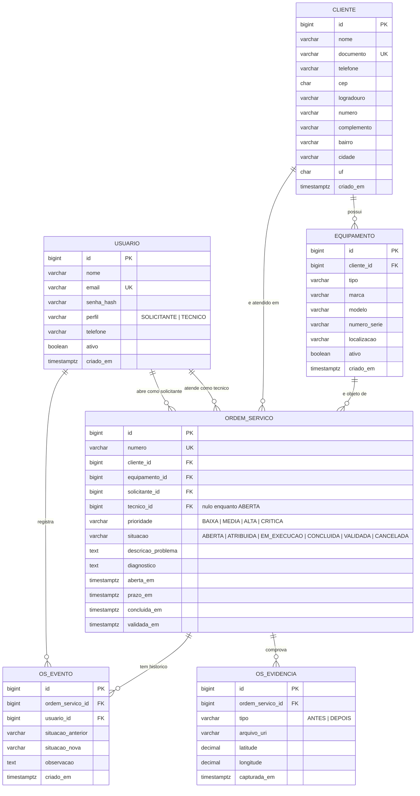

# Modelagem de dados — GOS

Diagrama Entidade-Relacionamento, dicionário de dados e decisões de normalização do
sistema de gestão de ordens de serviço.

---

## 1. Diagrama Entidade-Relacionamento

---

## 2. Dicionário de dados

### 2.1 `usuario`

Usuários autenticáveis do sistema. Atende ao R2.

| Coluna | Tipo | Restrições | Observação |
| --- | --- | --- | --- |
| `id` | `bigserial` | PK | |
| `nome` | `varchar(120)` | não nulo | |
| `email` | `varchar(160)` | não nulo, único | Identificador de autenticação |
| `senha_hash` | `varchar(255)` | não nulo | Resumo criptográfico, nunca a senha (RNF07) |
| `perfil` | `varchar(20)` | não nulo, domínio restrito | `SOLICITANTE` ou `TECNICO` |
| `telefone` | `varchar(20)` | | |
| `ativo` | `boolean` | não nulo, padrão verdadeiro | Exclusão lógica |
| `criado_em` | `timestamptz` | não nulo, padrão agora | |

### 2.2 `cliente`

Pessoa física ou jurídica atendida. Endereço obtido via ViaCEP (R7).

| Coluna | Tipo | Restrições | Observação |
| --- | --- | --- | --- |
| `id` | `bigserial` | PK | |
| `nome` | `varchar(120)` | não nulo | |
| `documento` | `varchar(18)` | único | CPF ou CNPJ |
| `telefone` | `varchar(20)` | não nulo | |
| `cep` | `char(8)` | não nulo | Somente dígitos |
| `logradouro` | `varchar(160)` | não nulo | Preenchido pelo ViaCEP |
| `numero` | `varchar(15)` | não nulo | Informado pelo usuário |
| `complemento` | `varchar(80)` | | |
| `bairro` | `varchar(90)` | não nulo | Preenchido pelo ViaCEP |
| `cidade` | `varchar(90)` | não nulo | Preenchido pelo ViaCEP |
| `uf` | `char(2)` | não nulo | Preenchido pelo ViaCEP |
| `criado_em` | `timestamptz` | não nulo, padrão agora | |

### 2.3 `equipamento`

Bem do cliente sobre o qual o serviço é executado. Entidade principal para o R3.

| Coluna | Tipo | Restrições | Observação |
| --- | --- | --- | --- |
| `id` | `bigserial` | PK | |
| `cliente_id` | `bigint` | FK → `cliente.id`, não nulo, restringe exclusão | |
| `tipo` | `varchar(60)` | não nulo | Ex.: câmara frigorífica, expositor |
| `marca` | `varchar(60)` | | |
| `modelo` | `varchar(60)` | | |
| `numero_serie` | `varchar(60)` | | |
| `localizacao` | `varchar(120)` | | Onde está na instalação do cliente |
| `ativo` | `boolean` | não nulo, padrão verdadeiro | |
| `criado_em` | `timestamptz` | não nulo, padrão agora | |

### 2.4 `ordem_servico`

Entidade central. Concentra as regras RN01 a RN05.

| Coluna | Tipo | Restrições | Observação |
| --- | --- | --- | --- |
| `id` | `bigserial` | PK | |
| `numero` | `varchar(20)` | não nulo, único | Identificador legível |
| `cliente_id` | `bigint` | FK → `cliente.id`, não nulo | |
| `equipamento_id` | `bigint` | FK → `equipamento.id`, não nulo | |
| `solicitante_id` | `bigint` | FK → `usuario.id`, não nulo | Autoriza a validação (RN05) |
| `tecnico_id` | `bigint` | FK → `usuario.id`, nulo permitido | Nulo enquanto `ABERTA` |
| `prioridade` | `varchar(10)` | não nulo, domínio restrito | Base do cálculo do prazo (RN02) |
| `situacao` | `varchar(15)` | não nulo, domínio restrito | Estado na máquina (RN01) |
| `descricao_problema` | `text` | não nulo | |
| `diagnostico` | `text` | | Obrigatório para concluir (RN04) |
| `aberta_em` | `timestamptz` | não nulo, padrão agora | |
| `prazo_em` | `timestamptz` | não nulo | Derivado na abertura (RN02) |
| `concluida_em` | `timestamptz` | | |
| `validada_em` | `timestamptz` | | |

Restrições adicionais:

- `tecnico_id` obrigatoriamente não nulo quando `situacao` for diferente de `ABERTA`
  e `CANCELADA`
- `tecnico_id` diferente de `solicitante_id`, impedindo autoexecução e autovalidação
- índice sobre (`situacao`, `prazo_em`) para o cálculo de aderência a prazo do RF25
- índice sobre (`tecnico_id`, `situacao`) para a verificação de limite da RN03

### 2.5 `os_evento`

Trilha de auditoria das transições. É o que torna a RN01 verificável.

| Coluna | Tipo | Restrições | Observação |
| --- | --- | --- | --- |
| `id` | `bigserial` | PK | |
| `ordem_servico_id` | `bigint` | FK → `ordem_servico.id`, não nulo, exclusão em cascata | |
| `usuario_id` | `bigint` | FK → `usuario.id`, não nulo | Autor da transição |
| `situacao_anterior` | `varchar(15)` | nulo apenas no evento de abertura | |
| `situacao_nova` | `varchar(15)` | não nulo | |
| `observacao` | `text` | | Justificativa em cancelamento |
| `criado_em` | `timestamptz` | não nulo, padrão agora | |

Inserção exclusivamente por acréscimo. Não há alteração nem exclusão de eventos.

### 2.6 `os_evidencia`

Comprovação fotográfica georreferenciada. Atende ao R8 e condiciona a RN04.

| Coluna | Tipo | Restrições | Observação |
| --- | --- | --- | --- |
| `id` | `bigserial` | PK | |
| `ordem_servico_id` | `bigint` | FK → `ordem_servico.id`, não nulo, exclusão em cascata | |
| `tipo` | `varchar(10)` | não nulo, domínio restrito | `ANTES` ou `DEPOIS` |
| `arquivo_uri` | `varchar(255)` | não nulo | Caminho local ou remoto |
| `latitude` | `decimal(10,7)` | | Nulo se a localização for negada |
| `longitude` | `decimal(10,7)` | | |
| `capturada_em` | `timestamptz` | não nulo | |

---

## 3. Normalização

O modelo está na terceira forma normal, com uma exceção deliberada, documentada
abaixo.

**Primeira forma normal.** Todos os atributos são atômicos. Endereço foi decomposto em
logradouro, número, complemento, bairro, cidade e unidade federativa em vez de um
campo único de texto livre. O histórico de situações foi extraído para `os_evento` em
vez de manter uma lista na ordem de serviço.

**Segunda forma normal.** Todas as chaves primárias são simples, de valor gerado, o
que elimina a possibilidade de dependência parcial.

**Terceira forma normal.** Nenhum atributo não chave depende de outro atributo não
chave, com a ressalva do item 3.1. Em particular, o prazo permanece armazenado em
`prazo_em` e não é derivável apenas da prioridade, porque depende também de
`aberta_em`; e a prioridade pode ser alterada ao longo do atendimento, situação em que
o prazo é recalculado e a mudança registrada em `os_evento`.

### 3.1 Denormalização deliberada do endereço

Existe dependência transitiva em `cliente`: `cep` determina `logradouro`, `bairro`,
`cidade` e `uf`. Em terceira forma normal estrita, esses atributos ficariam em uma
entidade `endereco` referenciada por `cep`.

A dependência foi mantida por três motivos:

1. A base de CEP é externa e mutável. Os Correios reorganizam faixas, e um logradouro
   consultado hoje pode ter denominação diferente no ano seguinte. Armazenar o
   endereço no cliente preserva o registro histórico do que foi cadastrado.
2. A aplicação precisa funcionar sem conectividade (R5). Uma tabela local de endereços
   só conteria os CEPs já consultados, o que não elimina a consulta remota e
   acrescenta um ponto de inconsistência.
3. O endereço é lido em conjunto com o cliente em toda consulta relevante, e nunca
   isoladamente.

A alternativa normalizada foi avaliada e descartada. O registro fica aqui para
sustentar a decisão na arguição.

---

## 4. Rastreabilidade

| Requisito | Onde é sustentado no modelo |
| --- | --- |
| R2 — perfis | `usuario.perfil`, com verificação de autoria em `ordem_servico.solicitante_id` |
| R3 — manutenção de dados | `cliente`, `equipamento` e `ordem_servico` |
| R4 — regras de negócio | `ordem_servico.situacao` e `os_evento` (RN01), `prazo_em` e `prioridade` (RN02), índice (`tecnico_id`, `situacao`) (RN03), `diagnostico` e `os_evidencia` (RN04), `solicitante_id` (RN05) |
| R5 — persistência local | Mesmo esquema replicado em SQLite, com coluna de controle de sincronização |
| R6 — persistência remota | Esquema em PostgreSQL, acesso por DAO sobre JDBC |
| R7 — serviço externo | Campos de endereço em `cliente`, preenchidos via ViaCEP |
| R8 — recurso nativo | `os_evidencia.arquivo_uri` (câmera), `latitude` e `longitude` (geolocalização) |
| R9 — consulta e visão consolidada | Índices sobre `situacao`, `prioridade`, `prazo_em` e `tecnico_id` |

---

## 5. Controle de sincronização na base local

A base local replica o esquema com duas colunas de controle em cada tabela
sincronizável:

| Coluna | Finalidade |
| --- | --- |
| `sync_pendente` | Indica registro criado ou alterado offline, ainda não enviado |
| `atualizado_em` | Instante da última alteração local, usado na resolução de conflito |

A resolução adotada é a de última escrita vencedora por registro, comparando
`atualizado_em`. Para `os_evento` não há conflito possível, porque a tabela só recebe
acréscimos.
